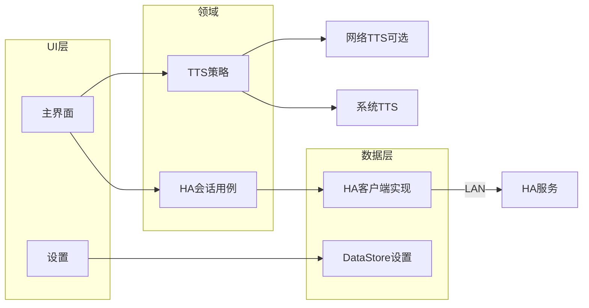

# 架构说明 — Herdroid

本文档描述客户端的分层、模块演进策略及与 HA、TTS 的集成边界。实现须与 [PRD.md](PRD.md) 一致；平台约定见 [ANDROID_CONVENTIONS.md](ANDROID_CONVENTIONS.md)。

## 1. 技术栈建议（Android 标准实践）

- **语言**：Kotlin。
- **UI**：Jetpack Compose + Material 3（见 [UI_UX.md](UI_UX.md)）。
- **架构模式**：单 Activity + Navigation Compose；表现层采用 **MVVM**（`ViewModel` + `UiState`）。
- **异步**：Kotlin 协程、`Flow`；连接与 IO 不阻塞主线程。
- **设置持久化**：Jetpack **DataStore**（Preferences），替代已弃用的 SharedPreferences 作为新代码默认选择。
- **依赖注入**：建议 Hilt 或 Koin（工程初始化时二选一，本文档不强制）。

## 2. 模块划分（可演进）

### 2.1 起步阶段（单模块 `app`）

适合协议未定、快速打通 MVP：

- `app`：UI、ViewModel、HA 客户端首版、DataStore、TTS 封装。

### 2.2 演进（多模块，可选）

当 HA 协议与网络 TTS 稳定后，可拆为：

| 模块 | 职责 |
|------|------|
| `:app` | Application、导航、主题、各 feature 入口 |
| `:core:network` 或 `:ha-client` | HA 连接抽象与具体实现（OkHttp / Ktor 等） |
| `:core:tts` | 系统 TTS、网络 TTS 适配器与统一接口 |
| `:core:model` | 共享数据模型与领域类型 |

原则：**依赖方向** 自 feature → core → 基础库；避免循环依赖。

## 3. 分层职责

### 3.1 表现层（UI）

- **主界面**：展示连接状态、最近消息或简化日志、**自动播报**开关。
- **设置**：协议/主机/端口、TTS 引擎类型、网络 TTS 参数。
- 通过 `ViewModel` 收集 `StateFlow`/`Flow`，单向数据流；副作用（如发起重连）经用户意图或 `LaunchedEffect` 触发。

### 3.2 领域 / 用例层（可选包结构）

- **HaSession**：封装「按当前配置连接 / 断开 / 重试」的用例，向上暴露连接状态与消息流。
- **TtsPolicy**：根据设置选择 `SystemTtsEngine` 或 `NetworkTtsEngine`；实现排队/打断策略（默认建议：**新消息打断当前朗读**，避免积压；若 PRD 另有决议则以此为准）。

### 3.3 数据层

- **HaClient（接口）**：`connect()`、`disconnect()`、`messages: Flow<Message>`、`connectionState: StateFlow<...>`。具体传输（WebSocket、SSE 等）由实现类完成，**不泄漏到 Composable**。
- **SettingsRepository**：读写 DataStore；与 `HaSession` 共享配置变更时可 `restartSession()`。

## 4. HA 连接抽象（协议待定）

在 HA 官方协议文档落地前，客户端侧约定：

- 配置项：`scheme`、`host`、`port`，解析为 `baseUrl` 或 `wsUrl`（实现时统一工厂方法）。
- **对接清单**：鉴权头、子路径、心跳间隔、重连退避（指数退避 + 上限）、最大消息长度。
- 所有假设记录在 PRD「开放问题」并在此交叉引用。

## 5. TTS 设计

| 组件 | 说明 |
|------|------|
| `TtsEngine` 接口 | `speak(text: String)`、`stop()`、`release()` |
| 系统实现 | 包装 `TextToSpeech`，处理初始化回调与语言 |
| 网络实现 | HTTP 客户端请求配置端点；播放 `MediaPlayer`/`ExoPlayer`（按返回格式选型） |
| 降级 | 网络失败时回退系统 TTS（若 PRD 确认） |

播报前可对文本做 **strip（Markdown/标签）**，规则依赖 PRD 中「消息语义」结论。

## 6. 组件与数据流（Mermaid）



数据流概要：

1. 用户修改设置 → DataStore 更新 → `HaSession` 收到配置变更 → 重连（策略见决议）。
2. `HaClient` 推送消息 → 若自动播报开启 → `TtsPolicy` → 选定引擎播放。

## 7. 包结构示例（单模块）

仅作命名参考，实现时可微调：

```
com.herdroid.app
  ui.main
  ui.settings
  feature.ha
  feature.tts
  data.ha
  data.settings
```

---

变更架构级决策时，请同步更新本文档与 PRD 开放问题。
