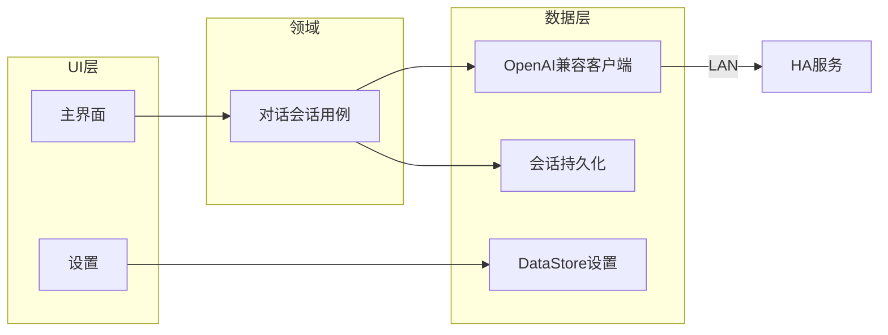

# 架构说明 — Herdroid

本文档描述客户端的分层、模块演进策略及与 HA 的 HTTP 接口集成边界。实现须与 [PRD.md](PRD.md) 一致；平台约定见 [ANDROID_CONVENTIONS.md](ANDROID_CONVENTIONS.md)。

## 1. 技术栈建议（Android 标准实践）

- **语言**：Kotlin。
- **UI**：Jetpack Compose + Material 3（见 [UI_UX.md](UI_UX.md)）。
- **架构模式**：单 Activity + Navigation Compose；表现层采用 **MVVM**（`ViewModel` + `UiState`）。
- **异步**：Kotlin 协程、`Flow`；连接与 IO 不阻塞主线程。
- **设置持久化**：Jetpack **DataStore**（Preferences），替代已弃用的 SharedPreferences 作为新代码默认选择。
- **依赖注入**：建议 Hilt 或 Koin（工程初始化时二选一，本文档不强制）。

## 2. 模块划分（可演进）

### 2.1 起步阶段（单模块 `app`）

适合协议未定、快速打通 MVP：

- `app`：UI、ViewModel、HA 客户端首版、DataStore、OpenAI 兼容对话客户端。

### 2.2 演进（多模块，可选）

当 HA 协议稳定后，可拆为：

| 模块 | 职责 |
|------|------|
| `:app` | Application、导航、主题、各 feature 入口 |
| `:core:network` 或 `:ha-client` | HA 连接抽象与具体实现（OkHttp / Ktor 等） |
| `:core:model` | 共享数据模型与领域类型 |

原则：**依赖方向** 自 feature → core → 基础库；避免循环依赖。

## 3. 分层职责

### 3.1 表现层（UI）

- **主界面**：展示连接状态、最近消息或简化日志、对话输入。
- **设置**：协议/主机/端口、API Key、模型名（对话根地址由协议/主机/端口拼接）。
- 通过 `ViewModel` 收集 `StateFlow`/`Flow`，单向数据流；副作用（如发起重连）经用户意图或 `LaunchedEffect` 触发。

### 3.2 领域 / 用例层（可选包结构）

- **ChatSession**：封装「按当前配置发起对话请求 / 持久化当前会话」的用例，向上暴露消息列表与交互状态。

### 3.3 数据层

- **OpenAiChatClient**：面向 Hermes API Server 的 OpenAI 兼容 `POST /v1/chat/completions` 客户端，按 SSE 增量解析文本。
- **SettingsRepository**：读写 DataStore，提供当前 profile 配置。
- **ChatSessionRepository**：持久化当前会话的 `session id` 与消息 JSON，用于「继续上次对话」。

## 4. HA 对话接入约定

客户端侧约定：

- 配置项：`scheme`、`host`、`port`，解析为 HTTP 根地址（`baseUrl`）。
- 对话请求使用 OpenAI 兼容 `POST /v1/chat/completions`，`stream: true`，响应 `text/event-stream`。
- 鉴权使用 `Authorization: Bearer <apiKey>`。
- 所有协议假设记录在 PRD「开放问题」并在此交叉引用。

## 5. 组件与数据流（Mermaid）



数据流概要：

1. 用户修改设置 → DataStore 更新 → 主界面读取新配置并用于后续请求。
2. 主界面通过 OpenAI 兼容客户端与由协议、地址、端口拼接的根地址进行对话。

## 6. 包结构示例（单模块）

仅作命名参考，实现时可微调：

```
com.herdroid.app
  ui.main
  ui.settings
  data.chat
  data.settings
```

---

变更架构级决策时，请同步更新本文档与 PRD 开放问题。
